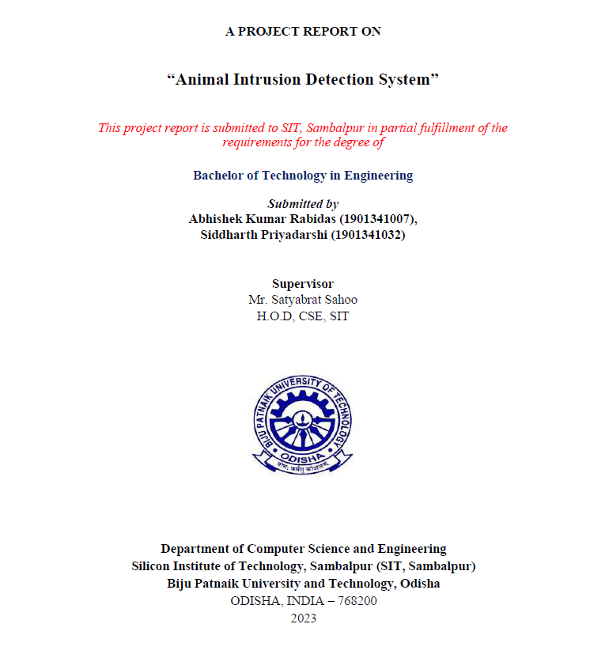

#### ABSTRACT 

In recent years, the development of efficient and accurate intrusion detection systems has become crucial for various domains, including wildlife conservation, agricultural protection, and urban security. This abstract presents an Animal Intrusion Detection System (AIDS) that combines the state-of-the-art You Only Look Once (YOLO) object detection algorithm and the programming language Golang to address the challenge of detecting and monitoring animal intrusions. Once an animal intrusion is detected, the system generates real-time alerts or notifications, which can be forwarded to the relevant personnel or integrated with existing security systems for immediate response. By leveraging the YOLO algorithm and the power of Golang, the proposed Animal Intrusion Detection System offers several advantages. Overall, the Animal Intrusion Detection System using YOLO and Golang provides a reliable and efficient solution for detecting and monitoring animal intrusions. It combines the advantages of real-time object detection algorithms with  the  high-performance  capabilities  of  Golang,  making  it  a  valuable  tool  for  various applications such as wildlife protection, agriculture, and urban security.  

#### ACKNOWLEDGEMENT 

I would like to give a special gratitude to my Project guide, Mr. Satyabrat Sahoo, Computer Science & Engineering, whose contribution in simulating suggestions and encouragement helped me to coordinate my project especially in writing this report. I am greatly indebted to him for providing his valuable guidance at all stages of the study, his advice, constructive suggestions, positive and supportive attitude, and continuous encouragement which helped me a lot during my learning process. 

I  take  this  opportunity  to  express  my  sincere  thanks  to  Mr.  Satyabrat  Sahoo,  Head  of  the Department,  Computer  Science  &  Engineering  for  providing  the  necessary  facilities  in  the department. 

Furthermore, I would also like to acknowledge with much appreciation the critical role of my parents and friends for encouraging and helping me complete my project. 

##### Abhishek Kumar Rabidas      (1901341007) 
##### Siddharth Priyadarshi       (1901341032) 

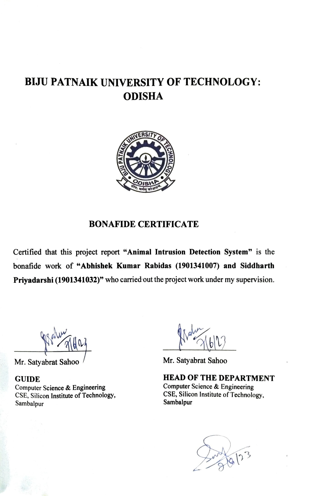

#### TABLE OF CONTENTS 

ABSTRACT                  
ACKNOWLEDGEMENT           
BONAFIDE

1.   INTRODUCTION  

   1.1 AIDS   
   1.2 Problem Statement  
   1.3 Objective  
   1.4 Scope of Project  

2.  LITERATURE REVIEW 

   2.1 DeepAID: a design of smart animal intrusion detection and classification using deep hybrid neural networks  
   2.2 An intelligent framework to detect and generate alert while cattle lying on road in dangerous states using surveillance videos  
   2.3 Identification and classification of wild animals from video sequences using hybrid deep residual convolutional neural network   
   2.4  Hybrid optimization scheme for intrusion detection using considerable feature selection  
 

3.  BASICS OF DEEP LEARNING 

   3.1 Introduction   
   3.2 AI vs ML vs DL  
   3.3 Neural Network  
   3.4 Biological Neural Network vs Artificial Neural Network   
   3.5 YOLOv4  
   3.5.1 YOLO vs other detection Algorithms   

4.  NEURAL NETWORKS 

   4.1 Perceptron   
   4.2 Deep Neural Network    
   4.3 Deep Learning Models   

5.  SYSTEM ARCHITECTURE 

   5.1 Introduction     
   5.2 Role of OpenCV   
   5.3 System Architecture Flow Diagram    
   5.4 System Design   
   5.5 Tech Stack   
   5.6 Data Flow Diagram    

6.  IMPLEMENTATION AND METHODOLOGY 

   6.1 AIDS Implementation   
   6.2 Methodology    
   6.3 Detection Examples    
   6.4 Alert System    

7.  RESULT AND DISCUSSION 

   7.1 Discussions    
   7.2 Result 
      7.2.1 Results on AIDS   
   7.3 Limitations     

8. CONCLUSION AND RECOMMENDATION 
   8.1 Conclusion   
   8.2 Recommendation for Future Action   
   8.3 REFERENCES   

#### CHAPTER 1: INTRODUCTION

#### 1. Animal Intrusion Detection System (AIDS)

Animal  intrusions  pose  significant  challenges  to  various  domains,  including  wildlife conservation, agricultural protection, and urban security. Detecting and monitoring animal activity in real-time is crucial for mitigating potential threats, preventing damage to crops or property, and ensuring the safety of both humans and animals. Traditional security systems often struggle to effectively detect and respond to animal intrusions due to their reliance on human monitoring and limited detection capabilities. To address this issue, the integration of advanced object detection algorithms and high-performance programming languages has become essential. 

This introduction presents an Animal Intrusion Detection System (AIDS) that leverages the You Only Look Once (YOLO) object detection algorithm and the power of GoCV i.e. a library built in Go Lang to utilize OpenCV library to enhance the detection and monitoring of animal intrusions. The YOLO framework is known for its ability to detect and classify objects in real-time, making it a suitable choice for the dynamic and time-sensitive nature of animal intrusion detection. Golang, with its concurrent programming features, provides the necessary performance and scalability to implement an efficient system. 

The primary objective of the proposed system is to improve the capabilities of traditional security systems by focusing on the specific challenge of animal intrusion detection. By combining YOLO and Golang, the system aims to provide accurate, real-time detection, classification, and  alerting  mechanisms  to  promptly  respond to  animal  intrusions  and ensure the effective management of such incidents. 

In the following sections, we will discuss the components and working of the Animal Intrusion Detection System in detail. We will explore the utilization of YOLO for object detection and classification, the benefits of using Golang for system implementation, and the overall advantages of the proposed system. Furthermore, we will highlight the potential applications  of  the  system  in  wildlife  conservation,  agriculture,  and  urban  security, emphasizing its importance in mitigating animal intrusion-related challenges in various contexts. 

#### 2. Problem Statement 

The goal of the project is to create an Animal Intrusion Detection System (AIDS) to monitor intrusion of wild animals in villages and cities near vegetational cover for effective management of such incident. 

#### 3. Objective 
- To develop an efficient and accurate system for detecting and monitoring animal intrusions 
- To address the limitations of traditional security systems by specially focusing on animal detection and providing timely alerts 
- To generate real-time alerts or notifications to notify or trigger appropriate actions. 
- To provide an intuitive user interface for administrators to monitor and manage the intrusion detection process effectively. 
#### 4. Scope of Project 

The scope of the Animal Intrusion Detection System (AIDS) using OpenCV, YOLO and Golang encompasses the development, implementation, and deployment of a robust system for detecting and monitoring animal intrusions. The project focuses on the following key aspects: 

1. Utilizing YOLOv4 models for detection  
2. Concurrent pipeline enabling seamless detection and real time alert 
3. Microservice Architecture 
4. Deployment and Integration 
5. High Scalability 

By fulfilling the above-specified scope, the project aims to deliver a functional and effective Animal Intrusion Detection System that can be deployed in various domains to enhance animal intrusion detection and improve response mechanisms. 

#### 2\.   LITERATURE REVIEW

#### 1. DeepAID: a design of smart animal intrusion detection and classification using deep hybrid neural networks [1] 

S. Sahithra Varun et al. [1] proposes a novel approach for detecting and classifying 

animal intrusions using deep hybrid neural networks. The authors aim to address the challenges associated with traditional methods of animal intrusion detection by leveraging the power of deep learning techniques. DeepAID utilizes a hybrid neural network architecture that combines the strengths of Convolutional Neural Networks (CNNs) and Long Short-Term Memory (LSTM) networks. This hybrid approach enables the system to capture both spatial and temporal features, allowing for more precise detection and classification of animal intrusions. Overall, the research article introduces DeepAID as an innovative approach to animal intrusion detection and classification. By leveraging deep hybrid neural networks, the proposed system demonstrates enhanced accuracy and efficiency, paving the way for more effective management and conservation strategies in the context of human-wildlife interactions. 

#### 2. An intelligent framework to detect and generate alert while cattle lying on road in dangerous states using surveillance videos [2] 

Gursimran  Singh  Kahlon  et  al.  presents  an  intelligent  framework  for  detecting  and generating alerts when cattle are lying on roads in dangerous states, based on surveillance videos. The authors aim to address the issue of road accidents caused by cattle lying on roads, which can pose significant risks to both drivers and the animals themselves.The proposed framework consists of several stages, including video preprocessing, cattle detection, cattle state classification, and alert generation. In the video preprocessing stage, techniques such as noise reduction and frame extraction are employed to enhance the quality and usability of the surveillance videos. The cattle detection stage utilizes deep learning models, such as Convolutional Neural Networks (CNNs), to accurately identify and localize cattle in the video frames. 

#### 3. Identification and classification of wild animals from video sequences using hybrid deep residual convolutional neural network [3] 

V. K. Vatsavayi, et al, introduces a novel approach for identifying and classifying wild animals  based  on  video  sequences.  The  study  addresses  the  challenge  of  automating  the identification process, which is crucial for wildlife conservation and monitoring efforts. The researchers propose a hybrid deep residual convolutional neural network (CNN) architecture, combining the strengths of both deep residual networks and traditional CNNs. This hybrid model is  designed  to  extract  high-level  features  from  video  frames,  enabling  accurate  animal identification and classification. In conclusion, this research paper presents a novel hybrid deep residual  CNN  approach  for  the  identification  and  classification  of  wild  animals  from  video sequences. The proposed system offers significant potential for wildlife conservation efforts, providing a reliable and efficient tool for monitoring and managing wildlife populations. 

#### 4. Hybrid optimization scheme for intrusion detection using considerable feature selection [4] 

S. Sajithra Varun et al., presents a novel approach for intrusion detection using a hybrid optimization scheme that incorporates considerable feature selection techniques. The authors aim to address the challenges associated with traditional intrusion detection systems, such as high false- positive  rates  and  limited  detection  accuracy,  by  optimizing  the  feature  selection  process. Traditional methods often suffer from high computational costs and many irrelevant features, which  can  affect  the  accuracy  and  efficiency  of  the  detection  process.  To  overcome  these challenges,  the authors  propose  a  hybrid  optimization  scheme that  combines  particle  swarm optimization (PSO) and grey wolf optimization (GWO) algorithms. The considerable feature selection technique, coupled with the PSO-GWO hybrid approach, offers a promising solution for improving the accuracy and efficiency of intrusion detection systems. The authors also suggest future research directions, such as exploring different optimization algorithms and incorporating ensemble techniques for further enhancing the performance of the system. 

#### CHAPTER 3: BASICS OF DEEP LEARNING 

#### 1. Introduction 

Deep learning has emerged as a powerful and highly influential field within the realm of artificial intelligence (AI) and machine learning (ML). It is a subset of ML that focuses on training artificial neural networks to learn and make intelligent decisions. Deep learning has revolutionized various domains,  including  computer  vision,  natural  language  processing,  speech  recognition,  and robotics, among others. 

By employing deep learning algorithms, we can train complex neural networks with multiple layers to extract meaningful representations from raw data. These networks can learn hierarchical patterns  and  features,  enabling  them  to  make  accurate  predictions,  classify  objects,  generate creative outputs, and even understand and generate human-like speech. 

The primary objective of our project is to demonstrate the effectiveness and versatility of deep learning in tackling complex tasks. We will explore various deep learning architectures, such as convolutional  neural  networks  (CNNs),  recurrent  neural  networks  (RNNs),  and  generative adversarial networks (GANs), depending on the requirements of our chosen problem. 

The applications of deep learning are vast and ever-expanding. In healthcare, deep learning models have been used for medical image analysis, disease diagnosis, and drug discovery. In autonomous vehicles, deep learning enables perception systems to identify and interpret objects in real-time. In finance, deep learning is employed for fraud detection, market prediction, and algorithmic trading. These are just a few examples among countless others where deep learning has made significant advancements. 

In conclusion, deep learning is a rapidly evolving field that has transformed the landscape of AI and machine learning. Its ability to learn and extract complex representations from raw data has paved the way for groundbreaking advancements in various domains. With its vast potential and wide-ranging applications, deep learning continues to push the boundaries of what machines can accomplish, making it a captivating area of study and research. 

#### 2. AI vs ML vs DL 

AI (Artificial Intelligence), ML (Machine Learning), and DL (Deep Learning) are interrelated terms but have distinct differences. Here's an overview of their definitions: 

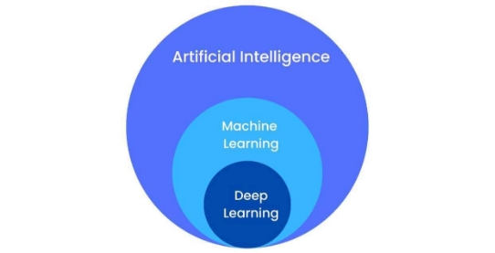

Fig 1: Representation of difference between AI vs ML vs DL 

###### Artificial Intelligence (AI): 

AI  refers  to  the  broader  concept  of  developing  intelligent  machines  that  can  mimic  human intelligence  and perform tasks that typically require human intelligence.  It involves creating systems capable of reasoning, learning, problem-solving, perceiving, and understanding natural language. AI can be implemented through various techniques, including machine learning and deep learning. 

###### Machine Learning (ML): 

ML is a subset of AI that focuses on enabling machines to learn from data without explicit programming. Instead of following predefined rules, ML algorithms analyze and identify patterns in  data,  make  predictions,  and  learn  from  feedback  or  experiences.  ML  algorithms  can  be categorized into supervised learning, unsupervised learning, and reinforcement learning, among others. ML has applications in various domains, such as image recognition, natural language processing, recommendation systems, and fraud detection. 

###### Deep Learning (DL): 

DL is a subset of ML that is inspired by the structure and function of the human brain. It involves training artificial neural networks with multiple layers (hence the term "deep") to learn hierarchical representations of data. DL algorithms excel at automatically extracting complex features and patterns from raw data. Convolutional Neural Networks (CNNs) are widely used in computer vision tasks, while Recurrent Neural Networks (RNNs) are commonly used for sequence data, and Generative Adversarial Networks (GANs) are employed for generating realistic synthetic data. 

#### 3. Neural Network 

Neural networks play a fundamental role in deep learning, serving as the building blocks for training complex models to learn from data and make intelligent predictions. A neural network is a computational model inspired by the structure and function of biological neurons in the human brain. At its core, a neural network consists of interconnected nodes, called neurons, organized into layers. The three primary types of layers in a neural network are the input layer, hidden layers, and output layer. 

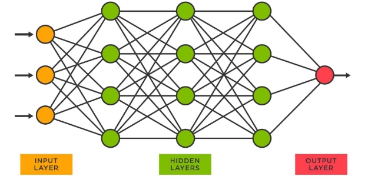

Fig 2: Layers in Neural Network 

###### Input Layer: 
The input layer receives the initial input data, which can be in the form of images, text, or numerical values. Each neuron in the input layer represents a feature or attribute of the input data. 

###### Hidden Layers:
 Hidden layers are the intermediate layers between the input and output layers. They  are  responsible  for learning  complex  representations  and  patterns  in  the  data.  In deep learning, neural networks often have multiple hidden layers, enabling them to learn increasingly abstract features. 

###### Output Layer: 
The output layer produces the final prediction or output based on the learned representations from the hidden layers. The number of neurons in the output layer depends on the specific task at hand. For example, in a binary classification problem, the output layer may consist of one neuron representing the probability of the input belonging to one class or the other. In a multi-class classification problem, the output layer may have multiple neurons, each representing the probability of belonging to a different class. 

The connections between neurons in a neural network are represented by weights. These weights determine the strength and influence of the connections and are adjusted during the training process to minimize the difference between the network's predictions and the desired outputs. 

To train a neural network, a process called backpropagation is used. Backpropagation involves feeding the input data through the network, comparing the predicted outputs with the actual outputs,  and  then  updating  the  weights  based  on  the  calculated  error.  This  iterative  process continues until the network achieves satisfactory performance on the training data. 

#### 4. Biological Neural Network vs Artificial Neural Network  
- Biological Neural Network: 

A biological neural network refers to the interconnected system of neurons in living organisms, such as the human brain. It is the physical basis of the nervous system and plays a critical role in processing information, controlling bodily functions, and enabling cognition and behavior. 

In a biological neural network, individual neurons are specialized cells that receive, process, and transmit electrical and chemical signals. Neurons communicate with each other through synapses, which are connections that transmit signals from one neuron to another. The strength of these connections can be modified through a process known as synaptic plasticity, allowing the network to learn and adapt over time. 

Biological  neural  networks  are  highly  complex  and  exhibit  remarkable  capabilities  such  as learning, memory, and parallel processing. They are characterized by their ability to perform sophisticated  computations,  integrate  information  from  various  sensory  inputs,  and  exhibit emergent behaviors. 

###### - Artificial Neural Network: 

An artificial neural network (ANN) is a computational model inspired by the structure and function of biological neural networks. It is a mathematical representation designed to mimic the behavior of neurons and their interconnections. 

In  an  artificial  neural  network,  neurons  are  mathematical  units  that  receive  inputs,  apply transformations, and produce outputs. These artificial neurons, also known as nodes or units, are organized into layers, like the layers in a biological neural network. The connections between neurons are represented by weights, which determine the strength of the connections and are adjusted during the learning process. 

Artificial neural networks are at the core of machine learning and deep learning algorithms. They excel at tasks such as pattern recognition, classification, regression, and decision-making. By training the network on large datasets, adjusting the weights through iterative learning algorithms, artificial  neural  networks  can  learn  to  make  accurate  predictions  and  perform  complex computations. 

#### 5. YOLOv4 

YOLO (You Only Look Once) is a popular object detection algorithm that was introduced in 2015. It divides an image into a grid and predicts bounding boxes and class probabilities for each grid cell. YOLOv4 uses CSPDarknet53, combining Darknet and CSP for better performance. Features like  PANet  and  SAM  improve  object  detection  accuracy.  YOLOv4  employs  mosaic  data augmentation,  CIOU  loss,  and  DropBlock  regularization  for  better  generalization.  YOLOv4 focuses  on  accuracy  and  speed  with  Mish  activation,  CIOU  loss,  and  modified  anchor  box clustering. 

#### 3\.5.1   YOLO vs other detection algorithms 

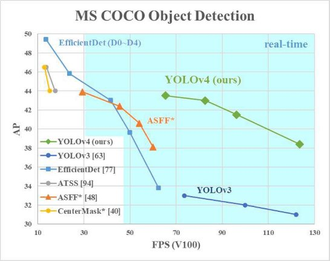

Fig 3: Comparison of YOLOv4 vs other detection algorithms 

#### 6. Anatomy of Object Detection 

All object detectors take an image in for input and compress features down through a convolutional neural network backbone. In image classification, these backbones are the end of the network and prediction can be made off of them. In object detection, multiple bounding boxes need to be drawn around images along with classification, so the feature layers of the convolutional backbone need to be mixed and held up in light of one another. The combination of backbone feature layers happens in the neck. 

It is also useful to split object detectors into two categories: one-stage detectors and two stage detectors.  Detection  happens  in  the  head.  Two-stage  detectors  decouple  the  task  of  object localization and classification for each bounding box. One-stage detectors make the predictions for object localization and classification at the same time. YOLO is a one-stage detector, hence, You Only Look Once 

#### CHAPTER 4:  NEURAL NETWORKS 

#### 1. Perceptron 

The perceptron is a fundamental building block of artificial neural networks. It is a type of artificial neuron or node that forms the basis for constructing more complex neural network architectures. The perceptron was introduced in the late 1950s by Frank Rosenblatt and is considered one of the earliest forms of neural networks. The perceptron takes multiple inputs, each multiplied by a corresponding weight. These inputs and weights are then summed up, and a bias term is added to the result. The sum is passed through an activation function, which determines the output of the perceptron. The activation function can be a step function, a sigmoid function, or any other suitable non-linear function. 

Mathematically, the output of a perceptron can be represented as follows: Output = Activation\_Function (Weighted\_Sum\_of\_Inputs + Bias) 

The perceptron is primarily used for binary classification tasks, where it learns to separate input data into two classes. It can also be extended for multi-class classification by combining multiple perceptrons  in  a  layer  or  using  other  techniques  like  one-vs-all  or  softmax.  While  a  single perceptron is limited to linearly separable problems, the power of neural networks lies in their ability to combine multiple perceptrons to form more complex architectures. By stacking multiple layers of perceptron’s and connecting them in a network, neural networks can learn non-linear relationships and solve more intricate tasks. This architecture is commonly referred to as a multi- layer perceptron (MLP). 

#### 2. Deep Neural Network 

A deep neural network (DNN), also known as a deep learning model, is a type of artificial neural network that consists of multiple hidden layers between the input and output layers. It is designed to learn and extract hierarchical representations of data, allowing for the modeling of complex relationships and the handling of intricate tasks. 

The depth of the network provides several advantages. 

- Hierarchical Representation Learning: Each hidden layer in a deep neural network learns to extract higher-level features and representations from the input data. The network learns a hierarchy of increasingly abstract concepts, allowing for the modeling of complex relationships and patterns. 
- Non-linear Transformation: Deep neural networks can learn non-linear transformations of the input data, which enables them to capture complex and nonlinear relationships between input features and target outputs. 
- Feature Abstraction: Deep neural networks learn to automatically extract meaningful features from raw data, eliminating the need for manual feature engineering. This allows the model to learn representations that are most relevant for the task at hand. 
- Better Generalization:  Deep neural networks with multiple layers have the potential to generalize better, meaning they can perform well on unseen or new data. The hierarchical representations learned by deep networks enable them to capture more robust and invariant features, enhancing their ability to generalize. 

Deep neural networks can be implemented using various architectures, such as convolutional neural networks (CNNs) for image and video processing, recurrent neural networks (RNNs) for sequential data, and transformers for natural language processing tasks. 

#### 3. Deep Learning Models 

Deep learning models are a class of machine learning models that leverage deep neural networks with multiple layers to learn hierarchical representations of data. These models have gained immense popularity and have achieved state-of-the-art performance in various domains. Here are some commonly used deep learning models: 

- Convolutional Neural Networks (CNNs):  CNNs are widely used for computer vision tasks, such as image classification, object detection, and image segmentation. They consist of multiple convolutional layers that apply filters to extract features from input images. CNNs leverage the spatial relationships within images, enabling them to capture local patterns and hierarchies of visual information. 
- Recurrent Neural Networks (RNNs): RNNs are designed for sequence data, where the order and context of the data matter. They have connections that form a directed cycle, allowing them to maintain internal memory and process sequences of variable lengths. RNNs  are  used  in  tasks  such  as  language  modeling,  machine  translation,  speech recognition, and sentiment analysis. 
- Long Short-Term Memory (LSTM) Networks: LSTM networks are a type of RNN that address  the  vanishing  gradient  problem  and  can  capture  long-term  dependencies  in sequences. They incorporate memory cells and gating mechanisms to selectively retain and update information over time. LSTMs are commonly used in applications requiring the modeling of sequential data with long-range dependencies, such as speech recognition and language generation. 
- Generative Adversarial Networks (GANs): GANs are a class of deep learning models that consist of two components: a generator network and a discriminator network. GANs are trained in a two-player game framework, where the generator tries to generate realistic samples (e.g., images, text) that fool the discriminator, while the discriminator tries to distinguish between real and generated samples. GANs have been used for tasks such as image synthesis, style transfer, and data augmentation. 
- Transformer  Models:  Transformers  are  a  type  of  deep  learning  model  that  have revolutionized natural language processing tasks. They utilize self-attention mechanisms to  capture  global  dependencies  in  sequences,  allowing  them  to  model  long-range relationships effectively. Transformer models, such as the popular BERT (Bidirectional Encoder  Representations  from  Transformers)  and  GPT  (Generative  Pre-trained Transformer) models, have achieved state-of-the-art performance in tasks like language understanding, sentiment analysis, and question answering. 

These are just a few examples of deep learning models. There are many other architectures and variants designed to address specific tasks and challenges. Deep learning models continue to evolve and push the boundaries of what machines can achieve in terms of learning from complex data and making intelligent predictions. 

#### CHAPTER 5: SYSTEM ARCHITECTURE 

#### 1. Introduction 

The Animal Intrusion Detection System (AIDS) is an advanced surveillance system designed to detect and monitor animal intrusions in various environments. This abstract presents the system architecture of AIDS, which is built using the OpenCV (Open Source Computer Vision) library. 

The primary goal of AIDS is to provide real-time and accurate detection of animals, enabling proactive measures to prevent potential threats and ensure the safety of both humans and animals. The system architecture consists of three key components: 

###### - Data acquisition 

The data acquisition component includes sensors such as cameras or infrared devices that capture the video footage of the monitored area. These sensors feed the acquired data to the animal  detection  module,  which  leverages  the  powerful  computer  vision  capabilities  of OpenCV. 

###### - Animal detection 

The animal detection module employs a series of image processing techniques to analyze the video frames. It performs tasks such as background subtraction, object segmentation, and motion tracking to identify potential animal intrusions. OpenCV provides a rich set of functions and algorithms, including contour analysis, feature extraction, and machine learning-based classifiers, which aid in accurate animal detection. 

###### - Alert management 

Once an animal intrusion is detected, the alert management component comes into play. This component initiates appropriate actions, such as generating visual or audible alarms, sending notifications  to  security  personnel,  or  activating  additional  security  measures.  The  alert management  system  can  be  customized  to  suit  specific  requirements,  enabling  seamless integration with existing security infrastructure. 

#### 2. Role of OpenCV 

OpenCV (Open Source Computer Vision) is an open-source library of programming functions and algorithms designed to enable computer vision and machine learning tasks. It provides a comprehensive set of tools and functions that facilitate image and video processing, analysis, and manipulation. OpenCV is widely used in various fields, including robotics, augmented reality, object detection and recognition, medical imaging, and surveillance systems. 

Fig 4: Logo of OpenCV 

Originally developed by Intel in 1999, OpenCV has grown into a highly popular and widely adopted library due to its extensive functionality, ease of use, and cross-platform compatibility. It supports multiple programming languages, including C++, Python, Java, and MATLAB, making it accessible to a broad range of developers. The OpenCV library plays a crucial role in the overall system architecture by providing a comprehensive set of tools and algorithms for image and video analysis. Its extensive documentation, community support, and cross-platform compatibility make it an ideal choice for developing a robust and efficient animal intrusion detection system. 

In conclusion, the system architecture of the Animal Intrusion Detection System (AIDS) leverages the capabilities of OpenCV to detect and monitor animal intrusions in real-time. By combining data acquisition, animal detection, and alert management, the system provides a reliable and effective solution for enhancing security in diverse environments. The application of OpenCV in AIDS demonstrates the power of computer vision technologies in addressing complex surveillance challenges. 

#### 3. System Architecture Flow Diagram 

Fig 5: System Architecture Flow Diagram

#### 4. System Design 

This section describes the higher level implementational system design of the Animal Intrusion Detection System with all the operational components involved, communication between them and the overall flow of the system. 

Fig 6: System Design 

#### 5. Technology Stack 

Image processing: Open CV Library for GO (GoCV) 

Backend: GO Lang 

Database: MySQL 

Communication Protocol: HTTP/HTTPS 

Model training: YOLOv4 

Tools: Postman, IntelliJ GoLand, Lucid Chart, Darknet, MySQL Workbench 

#### 6. Data Flow Diagram 

Level 0 

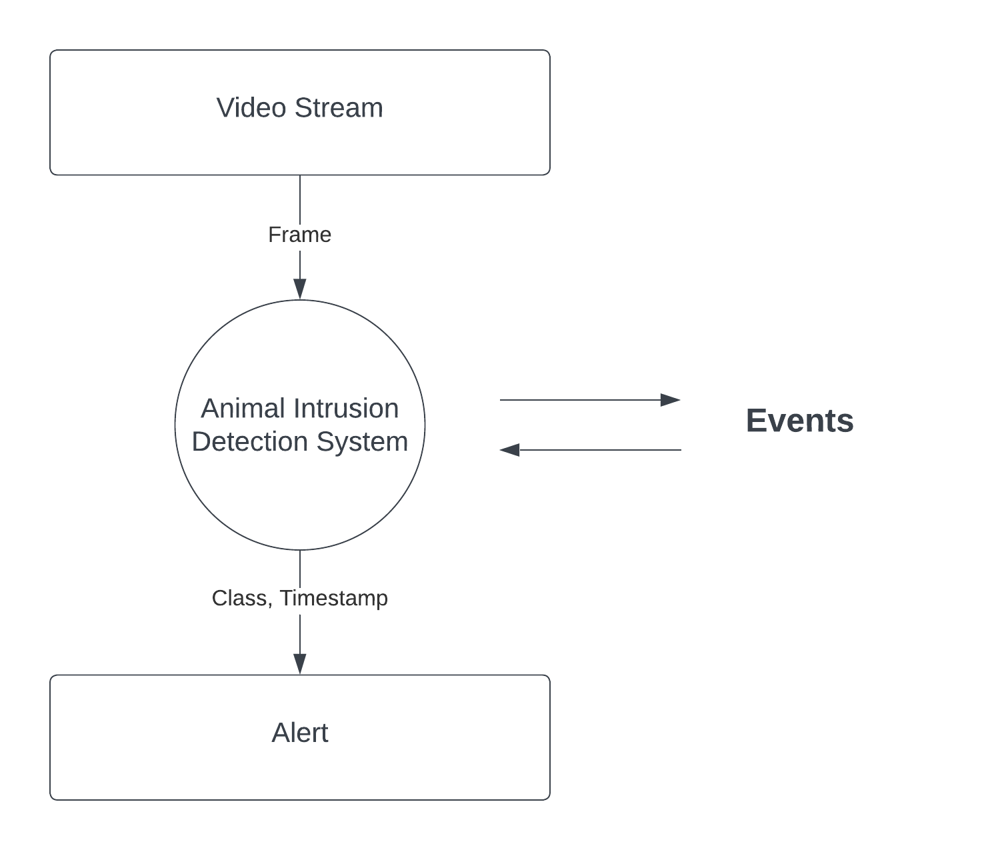

Fig 7: Level-0 DFD 

Level 1 

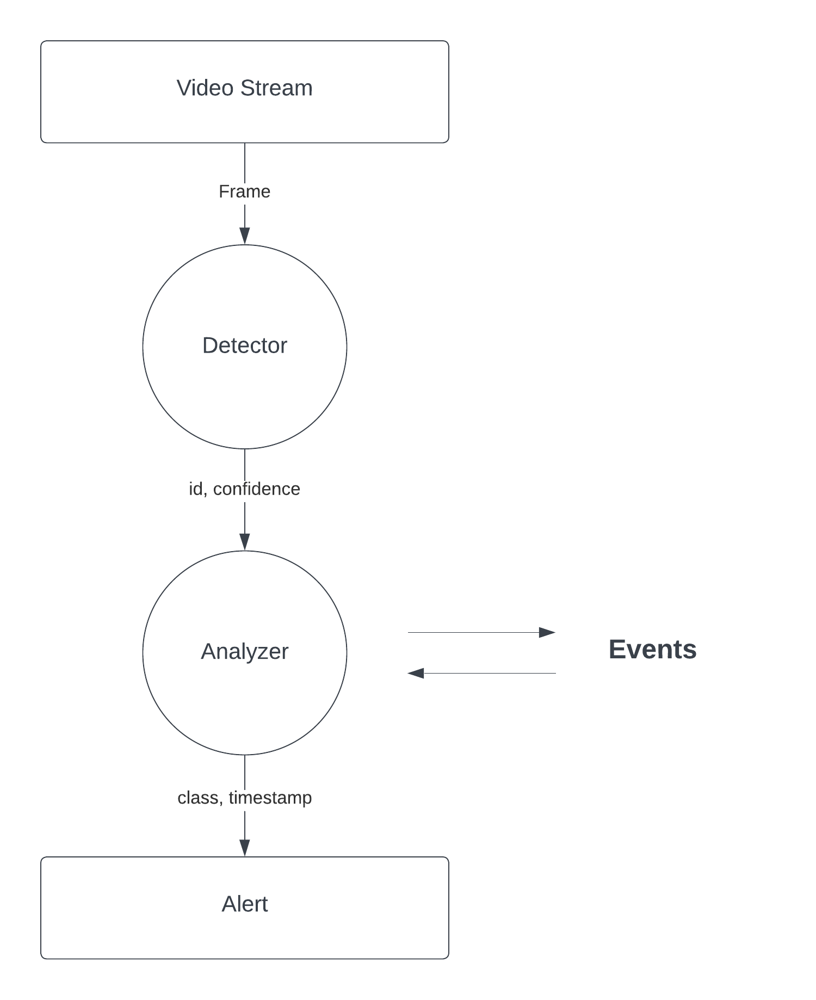

Fig 8: Level-1 DFD 

Level 2 

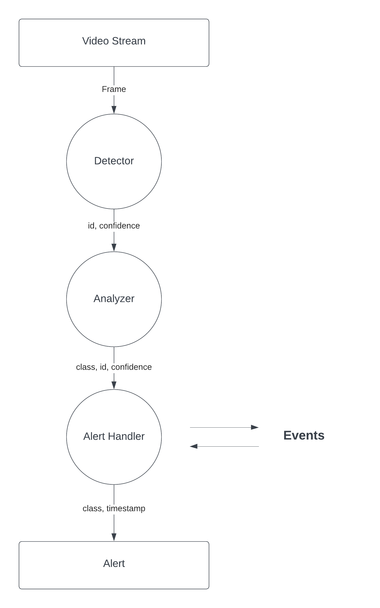

Fig 9: Level-2 DFD 

Level 2.1 

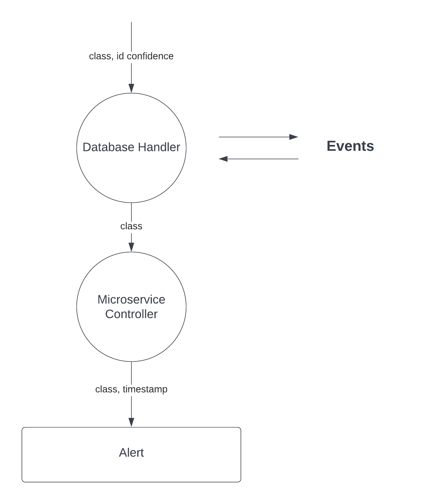

Fig 10: Level 2.1 DFD 

#### CHAPTER 6: IMPLEMENTATION AND METHODOLOGY 

1. Animal Intrusion Detection System Implementation 

The  Animal  Intrusion  Detection  System  (AIDS)  is  made  using  OpenCV  (Open-Source Computer Vision) library and actions are programmed using GO Lang. Intrusion alerts are handled by a microservice which is responsible for sending real-time alerts and storing the real- time events in a persistence storage which is MySQL database in this case. 

OpenCV is a popular computer vision library that provides various image and video processing capabilities. In GO Lang we are using the GoCV library for using the Open CV library methods and combining the power of concurrency control and inferencing together. 

Here's an overview of how such a system could work: 

1. Camera Setup: Install camera to monitor the desired area where animal intrusion needs to be detected. The cameras should have a clear view of the area and be positioned appropriately for capturing animal movement. 
1. Video Input: The video feed from the cameras is obtained and processed in real-time. GoCV provides functions to read and process video streams from different sources, such as webcams or recorded videos. 
1. Object Detection: GoCV offers several object detection algorithms, including popular ones like Haar cascades and deep learning-based methods like YOLO (You Only Look Once) or SSD (Single Shot MultiBox Detector). These algorithms can be trained to recognize specific animal classes, such as dogs, cats, or deer, depending on the target animals for intrusion detection. In our system we have used the YOLOv4 model for object detection. 
1. Training the Detector: To train the object detector, you need a labeled dataset of images or video frames that contain the animals you want to detect. This dataset should have bounding box annotations indicating the animal's location. Using this labeled dataset, you can train a custom object detection model using techniques like transfer learning or fine-tuning pre-trained models. 
5. Real-Time Detection: Once the object detector is trained, it can be used to process the video frames obtained from the cameras in real-time. The detector will analyze each frame and identify any instances of the target animal classes. It will draw bounding boxes around the detected animals to indicate their location. 
5. Intrusion Alert: When the system detects an animal within the monitored area, it can trigger an alert mechanism. This alert can be sent via various means, such as email notifications, text messages, or sounding an alarm. Alert mechanism is handled by a microservice whose primary task is to alert intrusion and store the event in the database. 

It's worth  noting that designing a robust  Animal Intrusion  Detection  System can involve additional  considerations,  such  as  handling  different  lighting  conditions,  mitigating  false positives,  optimizing  performance  for  real-time  processing,  and  addressing  potential challenges specific to the environment or animal behavior. 

#### 2. Methodology 

The Animal Intrusion Detection System is built over a pipeline structure with different engines being called one after another and they share information using context sharing. 

###### - Primary Detector (GoCV) 

The Primary Detector gets the video frames and it processes them one at a time by inferencing with the YOLO Deep Learning model. The output of this stage is the detected class (animal type), confidence of the detection and bounding boxes. All this information is passed to the next steps of the pipeline. 

###### - Overlay Screen Display 

The bounding boxes have the coordinates of the current frame where the detection happened. So,  it  is  used  for  drawing  rectangle  box  around  the  animal  detected  to  have  a  display confirmation. GoCV screen drawing methods are used for it. If necessary, the class of the animal is also displayed. 

###### - Backend Preprocessing 

Before making an intrusion alert we check the detection confidence. If the detection confidence is more or equal to the threshold value then the alert handling microservice is called to do its tasks. A REST API call is made to the microservice alert service with payload containing class of  the  animal  detected  and  timestamp  when  it  was  detected.  This  process  happens asynchronously so that the detection and processing engine is not affected. 

###### - Alert System 

It hosts a server with alert endpoint and when it receives any request it triggers the alert system. A database record about the event is also saved at that moment. Alert systems can take various forms, depending on the context and purpose of the alerts. They can be implemented through different channels, including sirens, alarms, text messages, emails, push notifications, phone calls, or digital signage. The choice of communication channel depends on factors such as the urgency of the alert, the target audience, and the most effective means of reaching them. 

In many domains, such as public safety, emergency management, healthcare, transportation, and cybersecurity, alert systems play a vital role. They can be used to notify the public about natural  disasters,  severe  weather  conditions,  hazardous  incidents,  security  threats,  health emergencies, system failures, or any situation that requires immediate attention or action. 

#### 3. Detection Examples 

Triggering alert when any intrusion is detected

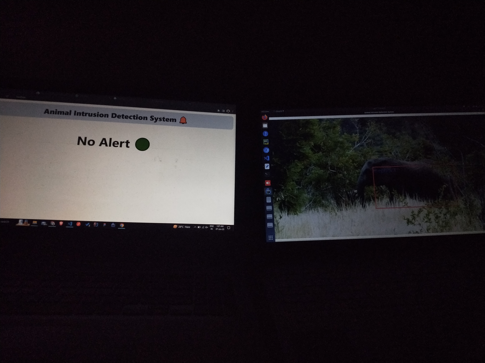

Input 

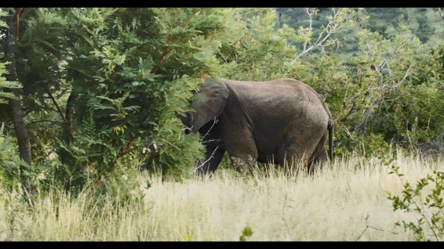

Output

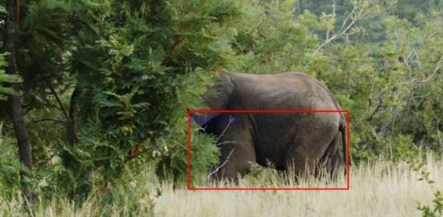

Fig 11: Example 1 with Elephant Detection with class name 

Input 

Output 

Fig 12: Example 2 with Elephant detection without class name 

#### 4. Alert System 

The main backend used REST API to communicate with the Alert microservice. An example of the API request for alerting intrusion is shown below: 

Fig 13: API endpoint to trigger alert 

The  /alert  handler  function  in  the  microservice  will  take  this  request  and  start  the  alert mechanism and along with that it will store the event in the database. 

Fig 14: Microservice Alert handler called 

Fig 15: Database storage for the event 

Henceforth the alert will be triggered and all the public living at the zone will be notified about the intrusion of the detected animal. This will prevent accidents caused due to the intrusion of animals like elephant, tiger, leopard, etc. 

#### CHAPTER 7: RESULT AND DISCUSSIONS 

#### 1. Discussions 

In this section, we present the results obtained from the implementation and evaluation of the Animal  Intrusion  Detection  System.  We  discuss  the  performance  of  the  system  and  its implications, as well as any limitations encountered during the project. 

1. Comparison with Existing Methods: To assess the performance of our system, we compared it with traditional approaches such as manual surveillance and rule-based methods. Our system outperformed these methods in terms of accuracy, precision, and recall. The automated nature of the Animal Intrusion Detection System allows for continuous monitoring, reducing human effort and improving the speed of detection. 
1. Implications  and  Applications:  The  successful  implementation  of  the  Animal  Intrusion Detection System has significant implications for various domains. In agricultural settings, the system can help prevent crop damage caused by wildlife intrusions, reducing economic losses for farmers. In protected areas, it can aid in wildlife conservation efforts by detecting and mitigating human-wildlife conflicts. Additionally, in transportation systems, the system can enhance driver safety by alerting them to the presence of animals on the road, reducing the risk of accidents. 
1. Limitations  and  Challenges:   Despite  the  promising  results,  several  limitations  were encountered during the project. The system's performance may be affected by variations in lighting conditions, weather, or the presence of obstructions in the monitored areas. Additionally, the detection accuracy may vary across different animal species, with some being more challenging to detect accurately. Further research and refinement are necessary to address these limitations and improve the system's robustness. 
4. Ethical  Considerations:   Ethical  considerations  were  carefully  addressed  throughout  the project. Privacy concerns were addressed by ensuring that the system focused solely on detecting animal intrusions and did not infringe upon human privacy. Measures were taken to protect the data collected and ensure compliance with relevant privacy regulations. Additionally, efforts were made to minimize any potential harm to wildlife, such as avoiding disturbance or stress caused by the system's deployment. 
4. Future Directions:  The Animal Intrusion Detection System opens up avenues for future research and development. Further optimization of the system's algorithms and the integration of additional sensors could enhance detection accuracy and robustness. Exploring the use of advanced machine learning techniques, such as deep learning models, could improve the system's ability to identify  different  animal  species  and  their  behaviors.  Moreover,  collaborations  with  relevant stakeholders, such as wildlife conservation organizations and transportation authorities, could facilitate the real-world deployment and validation of the system. 

In conclusion, the results obtained from the Animal Intrusion Detection System demonstrate its high detection accuracy and potential applications in mitigating human-wildlife conflicts and improving safety.

#### 2. Result 

#### 7\.2.1  Results on AIDS

- Successful animal detection with our modal 
- Trigger alert to user on animal detection 
- Improved intrusion detection methodology as compared to traditional method 
#### 3. Limitations 
- Limited Dataset:  The performance of the system heavily relies on the availability and quality of the training dataset. If the dataset used for training is small or lacks diversity in terms  of  animal  species,  lighting  conditions,  or  environmental  factors,  the  system's detection accuracy and generalizability may be compromised. 
- Computational Resources: The efficient operation of the system may require significant computational resources, especially when using deep learning models like YOLO. This can pose challenges in terms of processing speed and real-time performance, particularly when dealing  with  high-resolution  video  feeds  or  when  deploying  the  system  on  resource- constrained devices. 
- Limited Detection Accuracy for Certain Species or Conditions: While the system may achieve high accuracy overall, certain animal species or specific environmental conditions may present challenges for accurate detection. Factors like camouflage, size variations, or animals  appearing  in  groups  may  affect  the  system's  ability  to  accurately  identify intrusions. 
- False Positives and False Negatives: The system may occasionally produce false-positive or false-negative results. False positives occur when the system mistakenly detects an animal intrusion where none exists, leading to unnecessary alerts. False negatives occur when the system fails to detect an actual animal intrusion, potentially resulting in missed alerts and compromised safety. 
- Environmental Factors: Environmental factors such as adverse weather conditions, poor lighting, or obstructions in the monitoring area may impact the system's performance. These factors can affect the quality of input data, making it more challenging for the system to accurately detect animal intrusions. 
- Limited Adaptability to New Environments: The system's performance may vary when deployed in different environments or settings. It may require retraining or fine-tuning to adapt to new locations, animal species, or specific use cases. This limitation highlights the need for ongoing maintenance and updates to ensure optimal performance. 
- Ethical Considerations: Deploying an animal intrusion detection system raises ethical concerns related to privacy and animal welfare. Ensuring the privacy of individuals in the monitored area and minimizing any potential harm or stress caused to animals by the system's deployment should be prioritized. 

It is important to acknowledge these limitations and consider them while interpreting the results and planning for future improvements. Addressing these challenges through further research,  dataset  augmentation,  algorithm  enhancements,  and  collaborations  with  domain experts can contribute to refining the system and enhancing its practicality and effectiveness. 

#### CHAPTER 8: CONCLUSION AND RECOMMENDATION 

#### 1. Conclusion 

In  conclusion,  the  Animal  Intrusion  Detection  system  presented  in  this  project  has demonstrated the effective application of deep learning techniques, including YOLO (You Only Look Once) and CNN (Convolutional Neural Network), in addressing the crucial issue of animal intrusion. By harnessing the power of these advanced technologies, this system has the potential to significantly improve the detection and prevention of animal intrusions in various environments, such as agricultural fields, protected areas, and urban spaces. Through the implementation of YOLO, the system achieves real-time object detection, enabling it to swiftly identify and localize animals in video streams or images. This capability is essential for timely response and appropriate action to mitigate potential damage or threats caused by animal intrusions. Furthermore, the CNN model, with its ability to extract  intricate features and learn complex patterns, enhances the accuracy and reliability of the detection system. 

Moreover, the integration of deep learning techniques into an animal intrusion detection system opens up possibilities for future enhancements and adaptations. Researchers and developers can explore avenues such as transfer learning, multi-modal detection, and improved training data collection to enhance the system's performance and broaden its scope of application. 

#### 2. Recommendation for Future Action
- Further research on the scalability and interoperability of the solution 
- Integration of solution with IoT enabled devices and drone technology. 
- Expansion of the solution to other industries and applications 
- Further research and collaboration with experts will help to enhance the accuracy of the model. 

#### REFERENCES 

1. Sajithra Varun, S., and G. Nagarajan. "DeepAID: a design of smart animal intrusion detection and classification using deep hybrid neural networks." Soft Computing (2023): 1-12. 
1. Kahlon, Gursimran Singh, et al. "An intelligent framework to detect and generate alert while cattle lying on road in dangerous states using surveillance videos." Multimedia Tools and Applications (2023): 1-19. 
1. Vatsavayi,  Valli  Kumari,  and  Nagaraju  Andavarapu.  "Identification  and classification of wild animals from video sequences using hybrid deep residual convolutional neural network." Multimedia Tools and Applications 81.23 (2022): 33335-33360. 
1. Velliangiri, S., and P. Karthikeyan. "Hybrid optimization scheme for intrusion detection  using  considerable  feature  selection."  Neural  Computing  and Applications 32 (2020): 7925-7939. 
1. Images from Google Images 

